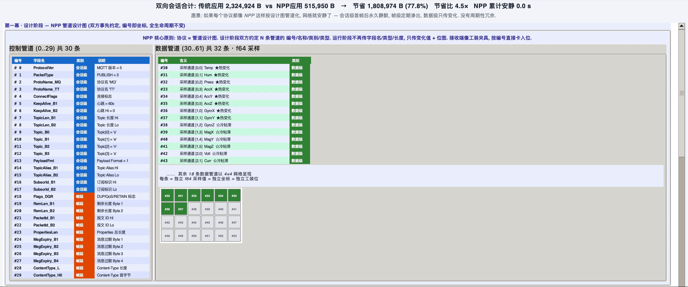
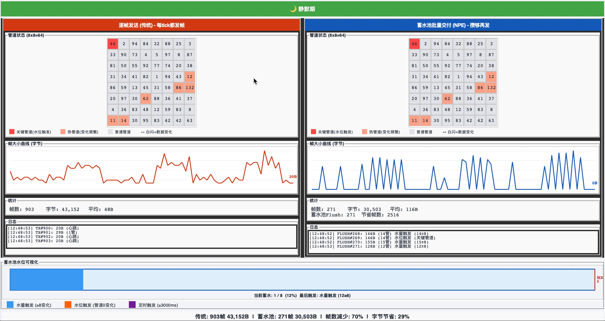
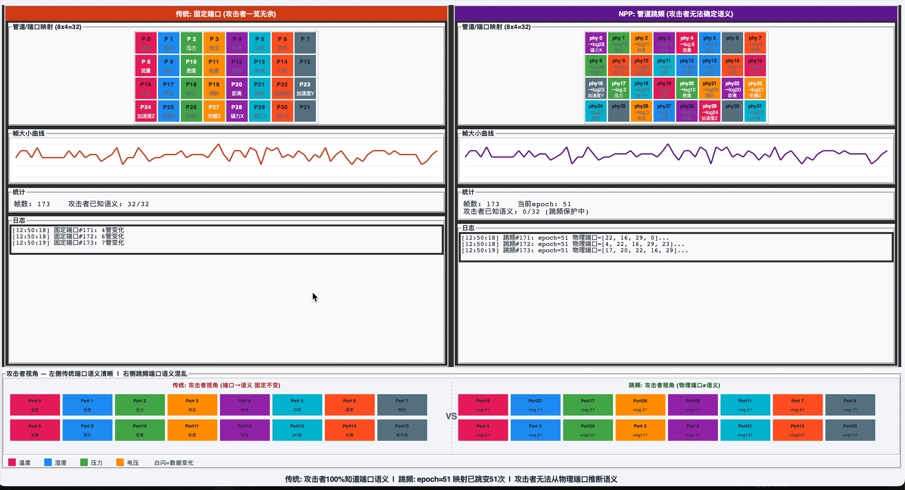
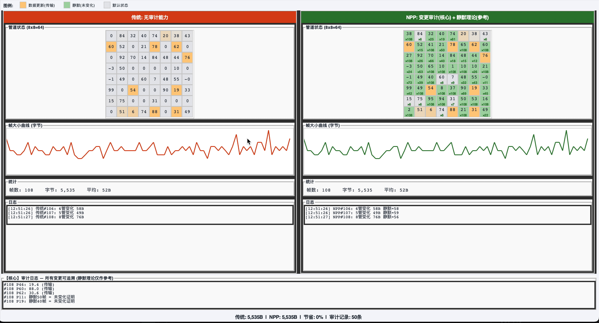
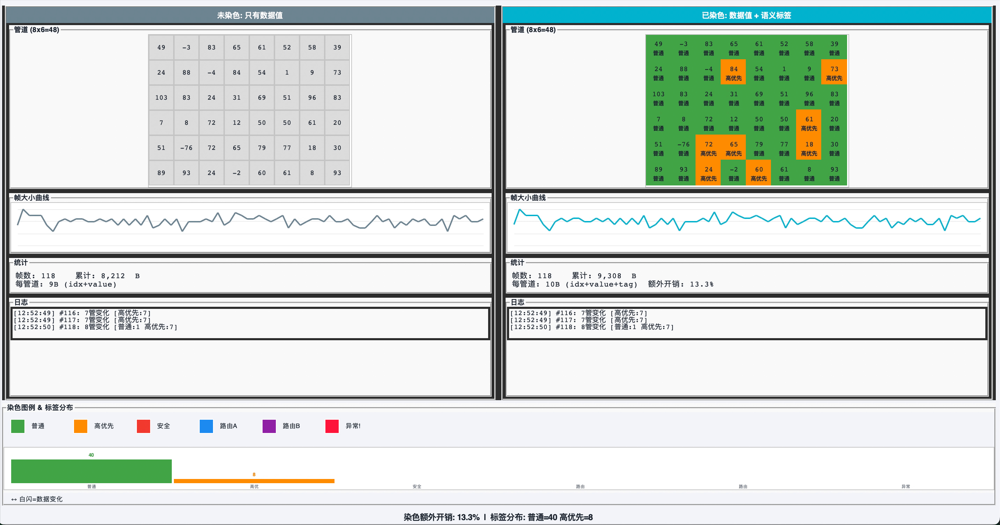

# NPP SDK - 基于NPE架构的高性能网络通信引擎

> 纯C语言实现的半开源网络通信协议栈，以增量传输范式替代传统全量传输，大幅降低计算和带宽开销。

<div align="center">

[-MIT-yellow.svg)](LICENSE)](https://en.wikipedia.org/wiki/MIT_License)
[](https://en.wikipedia.org/wiki/C99)
[]()
[]()
[](https://zenodo.org/doi/10.5281/zenodo.21844224)
[](https://orcid.org/0009-0007-6411-7426)

[English](./README.md) | [中文](./README_CN.md)

</div>

---

## 🎯 核心理念：管道化架构

NPP基于NPE（Natural Pipeline Engine）架构，将网络通信从"计算驱动"升级为"比较驱动"。


*帧拆分成管道形式：每个数据流被分解为独立的"管道"，每个管道自维护状态*

---

## ⚡ 传统 vs NPP：通信范式对比

### 传统网络通信

- **全量传输**：每帧传输完整数据，即使99%数据未变化
- **周期心跳**：设备空闲时仍需发送保活包，消耗带宽和电量
- **计算密集**：CPU参与封包/解包、校验/重传

### NPP网络通信

- **增量传输**：仅传输变化的管道数据，静态时零带宽消耗
- **静默即证明**：无数据变化=设备在线，无需心跳包
- **比较驱动**：核心操作仅为比较和赋值，无乘除运算

---

## ✨ 核心功能展示

### 🏗️ 管道化架构

*帧拆分成管道形式：每个数据流被分解为独立的"管道"，每个管道自维护状态*

### 💧 蓄水池机制

*批量交付机制：累积多次变化一次性交付，节省帧头开销，提高传输效率*

### 📡 管道跳频

*管道级跳频技术：遇到干扰时自动切换管道传输信道，确保通信可靠性*

### 🔍 可审计性

*完整的审计追踪：所有数据变化可追溯，确保透明可验证*

### 🎨 管道染色

*数据流可视化：颜色编码的管道状态，直观监控网络健康度*

---

## ✨ 核心优势

### 🔓 半开源模式：生态与产权的平衡
- **核心闭源**：核心协议层、唤醒调度、自适应算法等核心知识产权闭源保护
- **上层开源**：极简API、NPP Object封装、测试用例、示例代码、迁移工具全量开源
- **商业友好**：开源部分遵循MIT协议，闭源部分可授权商用

### ⚡ C语言实现：性能与跨平台兼得
- **原生性能**：纯C实现，性能比Python/Java提升100倍以上
- **极致轻量**：最小运行时<64KB ROM / 8KB RAM，可运行在8位MCU到64位服务器
- **无缝集成**：兼容所有C/C++开发环境，可直接嵌入Linux/RTOS/Bare-Metal系统

### 🌐 范式创新
- **静默即证明**：无数据变化时链路完全静默，本身就是"设备在线"的证明
- **状态自愈**：内置SYNC/REQ_SYNC机制，支持断线重连后自动同步全量状态
- **语义级容错**：UDP丢帧只影响单个字段，不影响全局系统
- **多播原生**：支持一次唤醒多设备，单帧数据可分发到数千个终端

---

## 🏗️ 协议分层

NPP 工作在**应用层**，运行在现有传输协议之上：

```
┌─────────────────────────────────────────┐
│  应用层: NPP (本协议)                    │  ← 当前位置
├─────────────────────────────────────────┤
│  传输层: UDP / TCP                      │
├─────────────────────────────────────────┤
│  网络层: IP                             │
└─────────────────────────────────────────┘
```

NPP **不替代** UDP/TCP。它提供：
- **状态同步**：只传输变化的数据，无冗余
- **管道复用**：每会话最多 512 个独立数据通道
- **状态自愈**：断线重连后自动 SYNC 全量状态

详见 [协议规范](./docs/PROTOCOL_OVERVIEW.md) 了解帧格式、可靠性模型和安全机制。

---

## 🔥 核心超能力

NPP SDK将复杂的网络通信封装为简单易用的强大能力：

### 🚀 零配置部署
```c
// 只需3行代码，建立完整的网络连接
npp_object_init(&sensor, "sensor_001", NULL);
npp_session_deploy(&sensor, 1);
// 完成！所有通信自动处理
```

### ⚡ 静默即证明（零带宽心跳）
- 无数据变化 = 链路完全静默
- 无需心跳包，无需保活流量
- 静态场景**节省95%以上带宽**
- 本身就是"设备在线"的证明

### 🔄 状态自愈
- 内置SYNC/REQ_SYNC机制
- 断线重连后自动同步全量状态
- **<100ms**恢复时间（传统TCP需1-10秒）

### 📡 多播原生
- 一次唤醒多设备
- 单帧数据分发到数千终端
- 开发效率**提升10倍**（无需额外实现）

### 💧 智能批量交付（蓄水池）
- 累积多次变化，一次性交付
- 节省帧头开销
- 自动适应网络状况

### 📡 管道跳频
- 管道级动态跳频
- 遇到干扰自动切换信道
- 确保通信可靠性

### 🔍 全量可审计
- 所有数据变化可追溯
- 透明可验证
- 满足工业/金融合规要求

---

## 🛠️ 快速入门

### 30秒上手：定义网络对象，自动完成数据同步

```c
/* 1. 定义网络对象，像定义struct一样简单 */
NPP_OBJECT(EnvironmentSensor) {
    NPP_PROPERTY(float, temperature);  // 温度，变化阈值0.1℃
    NPP_PROPERTY(float, humidity);     // 湿度，变化阈值1%
    NPP_PROPERTY(uint32_t, pm25);      // PM2.5，变化阈值1μg/m³
} NPP_OBJECT_END;

int main() {
    /* 2. 初始化对象和NPP会话 */
    EnvironmentSensor sensor;
    npp_object_init(&sensor, "sensor_001", NULL);
    
    /* 3. 注册属性变化回调，自动触发网络发送 */
    npp_on_change(&sensor, "temperature", on_temp_changed, NULL);
    
    /* 4. 部署会话，自动完成管道铺设、连接建立 */
    npp_session_deploy(&sensor, 1); // 1=发送端，0=接收端
    
    /* 5. 正常读写数据，NPP自动处理所有通信逻辑 */
    npp_set(&sensor, "temperature", 25.5f); // 变化超过阈值，自动发送
    npp_set(&sensor, "humidity", 60.0f);
    
    while(1) {
        npp_poll(&sensor); // 处理网络事件、状态同步
        sleep(1);
    }
    return 0;
}
```

> 开发者无需关心心跳包、重传、封包/解包、带宽优化等底层逻辑，NPP全自动处理。

---

## 📊 性能指标（已验证测试数据）

### 压缩性能

| 场景 | 传统JSON | NPP SDK | 压缩比 |
|------|---------|---------|--------|
| 静止（无变化） | ~990B | ~12B | **82倍** |
| 低频变化（10%） | ~990B | ~50B | **20倍** |
| 中频变化（30%） | ~990B | ~150B | **6.6倍** |
| 高频变化（70%） | ~990B | ~350B | **2.8倍** |

### 带宽节省

| 管道类型 | 传统MQTT | NPP | 节省比例 |
|---------|---------|-----|---------|
| 会话级（18条） | 每帧传输 | 首帧后静默 | **99%** |
| 帧级（12条） | 每帧传输 | 变化时传输 | **70-90%** |
| 数据级（32条） | 每帧传输 | 变化时传输 | **60-80%** |
| **总计** | **~560B** | **~20-100B** | **60-90%** |

### 测试覆盖

| 模块 | 测试用例 | 通过率 |
|------|---------|--------|
| Schema测试 | 4 | 100% |
| 帧测试 | 3 | 100% |
| 加密测试 | 2 | 100% |
| 后端测试 | 3 | 100% |
| 会话测试 | 5 | 100% |
| 服务端测试 | 5 | 100% |
| 跳频测试 | 2 | 100% |
| 蓄水池测试 | 2 | 100% |
| 染色测试 | 1 | 100% |
| **总计** | **186个断言** | **100%** |

> 数据来源：NPP SDK v2.0官方测试报告，64路传感器实时演示验证。

---

## 🧩 支持的场景

- **IoT物联网**：智能家居、工业传感器、农业监测、能源监控
- **边缘计算**：边缘节点通信、本地数据同步、低功耗广域网
- **嵌入式设备**：MCU通信、设备间直连、RTOS系统通信
- **分布式系统**：节点状态同步、服务发现、配置分发
- **弱网环境**：卫星通信、地下管网、高速移动场景

---

## 📁 项目结构

```
npp-sdk/
├── include/              // 公开头文件（开源，MIT协议）
├── lib/                  // 预编译二进制（闭源，商业授权）
│   ├── libnpp.a          // 静态库
│   └── README.md         // 下载说明
├── tests/                // 单元测试（开源，MIT协议）
├── examples/             // 示例代码（开源，MIT协议）
├── tools/                // 协议迁移工具（开源，MIT协议）
├── docs/                 // 设计文档（开源，CC-BY协议）
├── scripts/              // 构建脚本
│   ├── build_release.sh  // 构建预编译二进制
│   └── check_release.sh  // 发布前检查
├── MAINTENANCE.md        // 维护手册
├── RELEASE_CHECKLIST.md  // 发布检查清单
├── CONTRIBUTING.md       // 贡献指南
└── LICENSE               // 半开源协议
```

---

## 🚀 快速开始

### 1. 下载SDK

```bash
git clone https://gitee.com/Silicon-Perception/npe.git
cd npe
```

### 2. 使用预编译库

```c
// 只需要包含一个头文件！
#include <npp.h>

int main() {
    // 创建会话配置
    npp_session_config_t cfg = {
        .transport = NPP_TRANSPORT_UDP,
        .local_port = 8888,
        .remote_port = 9999,
        .remote_addr = "192.168.1.100"
    };
    
    // 创建会话
    npp_session_t* session;
    npp_session_create(&session, &cfg);
    npp_session_connect(session);
    
    // 写入数据
    uint8_t data[] = {1, 2, 3, 4};
    npp_pipe_write(session, 0, data, sizeof(data));
    
    // 清理
    npp_session_destroy(session);
    return 0;
}
```

### 3. 编译运行

```bash
gcc -o my_app my_app.c -I./include -L./lib -lnpp
./my_app
```

---

## 🤝 贡献与生态

我们欢迎开发者参与NPP生态建设：
1. 提交Bug报告和建议
2. 贡献示例代码和Demo
3. 提交协议迁移规则，支持更多传统协议自动转换
4. 参与上层应用开发，共同丰富NPP生态

注意：核心闭源部分不接受外部PR，仅贡献开源部分即可。

---

## 📜 许可证

本项目采用**半开源协议**：
- 开源部分（include/tests/examples/tools/docs）遵循MIT开源协议
- 闭源部分（src/核心实现）需获得商业授权后使用
- 详细内容见[LICENSE](./LICENSE)文件
- 版权归属：吴金辉 (Jinhui Wu)，ORCID: 0009-0007-6411-7426

## 📄 引用

如果您在研究中使用了本项目，请引用：

```bibtex
@software{npp_sdk_2026,
  author       = {Jinhui Wu},
  title        = {NPP SDK: High-Performance Network Communication Engine Based on NPE Architecture},
  month        = aug,
  year         = 2026,
  publisher    = {Zenodo},
  doi          = {10.5281/zenodo.21844224},
  url          = {https://zenodo.org/doi/10.5281/zenodo.21844224}
}
```

---

## 📧 联系我们

- 主仓库（国内推荐）：https://gitee.com/Silicon-Perception/npe
- 商业授权：alphache@163.com
- 镜像仓库（海外）：https://github.com/Silicon-Perception/npe

## 📖 文档

| 文档 | 说明 |
|------|------|
| [快速开始](./docs/INTEGRATION_GUIDE.md) | 5分钟教程、API 使用、故障排除 |
| [协议规范](./docs/PROTOCOL_OVERVIEW.md) | 帧格式、可靠性、安全、性能 |
| [系统设计](./docs/system-design.md) | 架构细节 |
| [更新日志](./CHANGELOG.md) | 版本历史 |

<!--
---

## 💝 支持本项目

如果NPP SDK对您有帮助，请考虑支持我们：

| 支付宝 | 微信支付 |
|--------|----------|
|  |  |
-->


---

> 基于NPE架构的创新，NPP SDK为网络通信提供更高效的解决方案。
